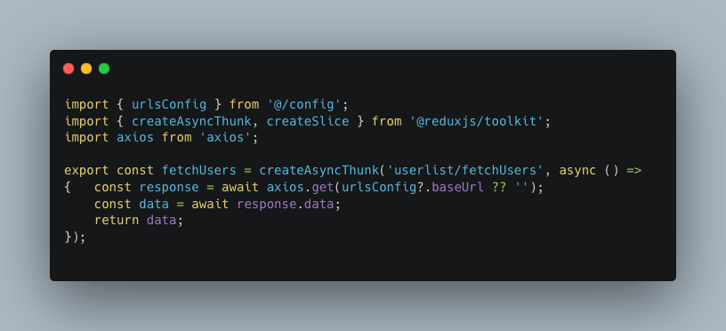
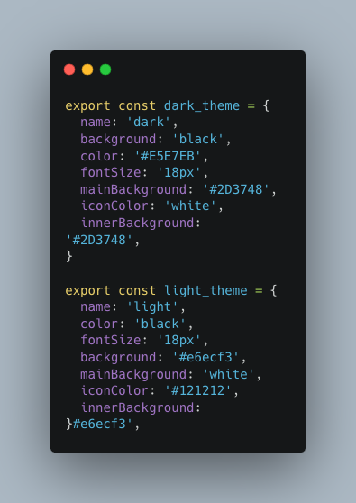

<head>
  <title>Adopter Experience 👥</title>
  <meta name="description" />
</head>

## Introduction 📖
Hello and welcome, adopters! 🌟 <br/>
In this section, we will provide you with a comprehensive overview of the Adopter Experience for the  application. Whether you are a user, tester, or stakeholder, this documentation aims to familiarize you with the functionalities, features, and benefits of our application from an adopter's perspective.

### Table of Contents

- [User Journey Overview 🚀](#user-journey-overview)
- [Application Features and Usage 🌟](#application-features-and-usage)
  - [URLs Configuration and Environment Setup](#urls-configuration)
  - [Configuration Management with `config`](#config)
  - [Global Theme Management and Dark Mode 🎨](#global-theme)
     - [Theme Configuration](#theme)
     - [Using the Theme Provider](#theme-provider)
     - [Customizing Theme Colors and Using Local Storage 🎨](#theme-customization)
  - [Using ESLint, Prettier, and Husky for Code Consistency ✨](#prettier-and-eslint)
     - [Setting Up ESLint and Prettier](#prettier-and-eslint)
     - [ESLint Configuration for Different Directories](#eslint-extended)
     - [Automating Code Consistency Checks with Husky](#husky)
     - [Further Customization and Resources](#further-customization-and-resources)

## User Journey Overview 🚀
<a id="user-journey-overview"></a>

As an adopter of the application, your journey starts here. This section will guide you through the process of getting acquainted with the application and utilizing its features to meet your goals.

## Application Features and Usage 🌟
<a id="application-features-and-usage"></a>

Our application offers a range of features designed to enhance your experience and productivity. From managing user interactions to accessing valuable insights, you'll find everything you need to achieve your objectives. Dive into our user-friendly interface, engage in meaningful conversations, and explore the power of intelligent automation.

### URLs Configuration and Environment Setup
<a id="urls-configuration"></a>

1. #### Accessing urlsConfig

   The urlsConfig can be accessed from the config folder in the apps/uci/web directory,specifically in the config folder in a file named urls_config.ts. The BaseUrls type, used in the configuration, is defined in a separate file located in the types folder of the directory. Here's how the BaseUrls type is defined in the base-urls.d.ts file:

   

2. #### Setting the Environment:

   The environment variable determines whether you're in a development or production environment. This variable is fetched from the NEXT_PUBLIC_ENVIRONMENT environment variable, which is configured in the apps/uci/web directory scripts within the package.json file. Here's how it's set up for a TurboRepo configuration:
     
  

   In the scripts section of package.json, you can see that the **NEXT_PUBLIC_ENVIRONMENT** variable is set explicitly when running the development (dev) and production (dev:prod) scripts using the cross-env utility.

   When you run ***npm run dev*** , it sets the environment to 'development'.Similarly,when you run ***npm run dev:prod***, it sets the environment to 'production'.

3. #### URLs Configuration:

   In the urls_config.ts file,each URL corresponds to a specific API endpoint or service. Here's an explanation of each URL and how users can customize them:

   - ***transportUrl***: This URL is used for establishing a WebSocket connection, typically for real-time communication with the application. 

   - ***chatHistoryUrl***: This URL is used to fetch chat history data from a server.
   
   - ***baseUrl***: This URL serves as the base URL for the application's main API endpoints. 

   - ***botDetailsUrl***: This URL is used for fetching details about a chatbot or related services. 

   - ***otpBaseUrl***: This URL is used for operations related to one-time passwords (OTPs) or authentication.

   Users can customize the urls by simply setting  environment variable in their development and production environments:

   ```
   const baseUrls: BaseUrls = {
    development: {
        transportUrl: process.env.NEXT_PUBLIC_DEV_TRANSPORT_SOCKET_URL,
        chatHistoryUrl: process.env.NEXT_PUBLIC_DEV_CHAT_HISTORY_URL,
        baseUrl: process.env.NEXT_PUBLIC_DEV_UCI_BASE_URL,
        botDetailsUrl: process.env.NEXT_PUBLIC_DEV_UCI_BOT_BASE_URL,
        otpBaseUrl: process.env.NEXT_PUBLIC_DEV_OTP_BASE_URL
    },
    production: {
        transportUrl: process.env.NEXT_PUBLIC_PROD_TRANSPORT_SOCKET_URL,
        chatHistoryUrl: process.env.NEXT_PUBLIC_PROD_CHAT_HISTORY_URL,
        baseUrl: process.env.NEXT_PUBLIC_PROD_UCI_BASE_URL,
        botDetailsUrl: process.env.NEXT_PUBLIC_PROD_UCI_BOT_BASE_URL,
        otpBaseUrl: process.env.NEXT_PUBLIC_PROD_UCI_OTP_BASE_URL
    },
   };
   ```

   To customize these URLs:

   **Development Environment**: Users can define their custom URLs by setting environment variables in their development environment. For example, in a .env.local file or equivalent:

   ```
   NEXT_PUBLIC_DEV_TRANSPORT_SOCKET_URL=http://localhost:3000/socket
   NEXT_PUBLIC_DEV_CHAT_HISTORY_URL=http://localhost:3000/history
   NEXT_PUBLIC_DEV_UCI_BASE_URL=http://localhost:3000/api/v1
   NEXT_PUBLIC_DEV_UCI_BOT_BASE_URL=http://localhost:3000/bot
   NEXT_PUBLIC_DEV_OTP_BASE_URL=http://localhost:3000/otp
   ```

   **Production Environment**: For the production environment, users can similarly define their custom URLs by setting environment variables specific to the production environment:

   ```
   NEXT_PUBLIC_PROD_TRANSPORT_SOCKET_URL=wss://api.example.com/socket
   NEXT_PUBLIC_PROD_CHAT_HISTORY_URL=https://api.example.com/history
   NEXT_PUBLIC_PROD_UCI_BASE_URL=https://api.example.com/api/v1
   NEXT_PUBLIC_PROD_UCI_BOT_BASE_URL=https://api.example.com/bot
   NEXT_PUBLIC_PROD_OTP_BASE_URL=https://api.example.com/otp
   ```

4. **Accessing URLs Based on Environment**:

   To effectively use the urlsConfig in the application code and access URLs based on the environment, follow these steps:

   **Import urlsConfig**:

   In your application code, start by importing the urlsConfig object from the urls_config file. Ensure that you've set up this import correctly:

   ```
   // Import the urlsConfig
   import { urlsConfig } from '@/config/urls';
   ```
   This import statement allows you to access the URLs defined in the configuration.

   **Access Specific URLs**:

   Once you've imported urlsConfig, you can access specific URLs for the application. Use the following examples:

   - Accessing chatHistoryUrl:

    ```
    const chatHistoryUrl = urlsConfig?.chatHistoryUrl;
    ```

   - Accessing botDetailsUrl:

    ```
    const botDetailsUrl = urlsConfig?.botDetailsUrl;
    ```

  Example : 

  userListSlice.tsx
  


5. **Environment Console Logs**:
   - After setting up `urlsConfig`, you can log the chosen environment and the corresponding URLs using `console.log(environment)` and `console.log(urlsConfig)`.

6. **Switching Environments**:
   - When switching between development and production environments, update the `NEXT_PUBLIC_ENVIRONMENT` environment variable in your deployment settings.
   - The application will automatically use the correct URLs based on the environment.

By effectively utilizing the `urlsConfig`, you'll be able to effortlessly manage API endpoints and services across different environments. This ensures a seamless experience for both development and production scenarios, making your interactions with the application more efficient and reliable.

**Note:** It's important to ensure that your environment variables are correctly set up in your development and production environments for this feature to work as intended.

### Configuration Management with `config`
<a id="config"></a>

The `config` feature empowers you to centralize and manage various visual and functional aspects of the application in a single place. This includes settings for UI elements, icons, styles, URLs, and more. With the `config` object, you can effortlessly tailor your application's look and behavior without digging deep into the codebase. Let's dive into how to utilize and extend the `config` feature:

1. **Accessing `config`**:
   The config can be accessed from the config folder in the apps/uci/web directory,specifically in the config folder in a file named config.ts. 

2. **Configuration Structure**:
   - The `config` object is organized into different sections, such as `socket`, `list`, `starredlist`, `heading`, `tab`, `icon`, `search`, `chatList`, `chatItem`, `message`, and `chatWindow`.
   - Each section contains sub-settings to customize specific aspects of your application.

  ***starredlist***:

   - video_cover: This property defines the  video cover image for the starred list.

  ***sideBar***:

   - visible: Indicates whether the sidebar is visible. In this case, it's set to 'false,' which likely means the sidebar is hidden by default.

  ***search***:  

   - placeholder: The text to display as a placeholder in the search input.
   - padding, icon, iconPadding, outline, border, and borderRadius are styles and properties related to the search input.

  ***tab***:

   - margin and borderRadius control the styling of tabs.
   - bots.text: Text to display on the "Bots" tab.
   - Starredchat.text: Text to display on the "Starred Chat" tab.
   
  ***chatList***:

   - width, height, overflow, and margin define styles for the chat list container.
   
  ***chatItem***:

   - margin, textMargin, height, width, padding, and avatar properties control the styling of each chat item within the chat list.
   - avatar properties specify the styling for the chat item's avatar image.

  ***message***:

   - icon: The bot's icon image.
   - userImage: Configuration for the user's image, including its source, dimensions, and border radius.
   - iconSize: Size of icons in messages.
   - userInput, botMsg, and listItem are configurations related to user input, bot messages, and list items within chat messages.

  ***chatWindow***:

   - margin, borderRadius, and innerWindow properties control the chat window's overall styling.
   - topbar contains styling and properties for the chat window's top bar, including icons, text, and images.
   - window defines styling for the chat window itself.

  ***textInput***:

   - borderRadius, padding, margin, and sendIcon are properties related to the text input field for sending messages.

3. **Modifying Existing Settings**:
   - To adjust an existing setting, locate the appropriate section and change the desired properties.
   - For example, to change the text color of the chat icon, find the `icon` section and update the `colorScheme` property.
   


4. **Adding New Components**:
   - You can introduce new UI components to the `config` object.
   - Define a new section, such as `newComponent`, and configure its properties.
   -Here's how to utilize and extend the config feature effectively:

   ***Accessing the config Object***

   Firstly, ensure that you import the config object from the config.ts file inside the config folder, which you can access like this:

   ```typescript
   import { config } from '@/config/config';
   ```

   ***Applying config Settings in Styled-Components***

   Now, let's explore how to leverage the config settings within styled-components, making the styling process seamless and modular. For instance, let's create a styled button component using config properties:

   ```typescript
   import styled from 'styled-components';

   // Define a styled component using config properties
   export const StyledButton = styled.button`
    background-color: ${config.button.backgroundColor};
    color: ${config.button.textColor};
    border: ${config.button.border};
    border-radius: ${config.button.borderRadius};
    padding: ${config.button.padding};
    font-size: ${config.button.fontSize};
    
    &:hover {
        background-color: ${config.button.hoverBackgroundColor};
    }
   `;
   ```
   
   ***Using the Styled Component in the Components***

   Having created a styled component using config properties, you can now seamlessly incorporate it into your components. Here's an example of how you can use StyledButton within your component:

   ```typescript
   import React from 'react';
   import { StyledButton } from './StyledComponents'; // Update the import path

   const MyComponent = () => {
    return (
        <div>
            <StyledButton>Click me</StyledButton>
        </div>
    );
   };
   export default MyComponent;
   ```

   ***Customizing config for Your Needs***

   To make the most of the config feature, you can tailor the settings according to the requirements. For instance, you can modify properties like button.backgroundColor, button.textColor, button.border, and more to align with the desired styles:

   ```typescript
   // config.ts
   export const config = {
    button: {
        backgroundColor: 'blue',
        textColor: 'white',
        border: 'none',
        borderRadius: '5px',
        padding: '10px 20px',
        fontSize: '16px',
        hoverBackgroundColor: 'darkblue', // Customize hover color
    },
    // ... other config properties
   };
   ```
   
5. **Extending the `config`**:
   - As the application evolves, feel free to extend the `config` object with new sections and properties as needed.

   ***Adding New Sections to config***

   To cater to new functionalities or UI components, you can introduce entirely new sections within the config object. For instance, if you're adding a section for a "Notification Bar," you can proceed as follows:

   ```typescript
   // Extend the config object with a new "notificationBar" section
   config.notificationBar = {
    backgroundColor: '#FF5733',
    textColor: '#FFFFFF',
    icon: 'bell', // Icon name or path
    // Add more properties as needed
   };
   ```
   By following this approach, you've created a dedicated section within config to manage the styling and behavior of your Notification Bar.

   ***Configuring New Properties***

   Within each new section, you can define specific properties that cater to the requirements of your application. For instance, in the "notificationBar" section, you can set properties like backgroundColor, textColor, icon, and any other relevant attributes.

   ```typescript
   // Example of extending the "notificationBar" section
   config.notificationBar = {
    backgroundColor: '#FF5733',
    textColor: '#FFFFFF',
    icon: 'bell', // Icon name or path
    // Add more properties as needed
   };
   ```
   ***Accessing Extended config Properties***

   Once you've extended the config object, accessing the newly added properties is straightforward. Simply reference them using dot notation within your application code. For instance, to apply the background color of the Notification Bar:

   ```typescript
   // Access and apply the Notification Bar background color
   const notificationBarBackgroundColor = config.notificationBar.backgroundColor;
   ```
   Example

   chat-item/styled.ts
   

**Note:** While configuring the settings in `config`, be mindful of any dependencies or libraries used within your application to ensure seamless integration.

### Global Theme Management and Dark Mode 🎨
<a id="global-theme"></a>

Maintaining a consistent and visually appealing user interface is crucial for any application. The project provides a robust global theme management system that includes support for a dark mode. This allows you to seamlessly manage the appearance of the application and provide a better user experience.

### Theme Configuration
<a id="theme"></a>

The theme configuration is organized into a dedicated file, `theme.ts`(config folder), where you can customize various design elements to create a visually consistent application.

Here are the key components of the theme configuration:

  - **`dark_theme`**: Defines the properties for the dark mode. It specifies background colors, font colors, and other visual elements that contribute to a cohesive dark mode experience.

  - **`light_theme`**: Specifies the properties for the light mode, including background colors, font colors, and shadows.

  

#### Using the Theme Provider
<a id="theme-provider"></a>

We've implemented a `ThemeProvider` component that encapsulates the logic for theme management, including toggling between light and dark modes.

1. **Installation**:
   - To start using the theme provider, import it into your component file:

     ```typescript
     import { ThemeProvider, useTheme } from '@/providers/ThemeProvider'; // Update the path as needed
     ```

2. **Implementation**:

   **Wrapping a Specific Component with ThemeProvider**

   Wrap the specific component or component tree that needs the theme with the ThemeProvider. For example, if you want to apply the theme to a component called MyComponent, do it like this:

   ```typescript
   const MyComponent =()=> {
    const { theme, toggleTheme } = useTheme();

    return (
       <ThemeProvider theme={theme}>
        <Div>
            {/* Your component's content */}
           <button onClick={toggleTheme}>Toggle Theme</button>
        </Div>
      </ThemeProvider>
      );
   }
   ```

   **Using styled-components**

   ```typescript
   import { Box } from '@chakra-ui/react';
   import styled from 'styled-components';

   export const Div = styled.Box`
    color: ${({ theme }) => theme.color};

    @media (max-width: 768px) {
        margin-left: 20px;
     }
   `;
   ```

  
  
***Example***:

   starred-chats/page.tsx
   

   starred-chats/styled.ts
   

   In this example, you import the useTheme hook and use it to retrieve the current theme and the toggleTheme function. You can then apply the theme's background and font colors to your component.


#### Customizing Theme Colors and Using Local Storage 🎨
<a id="theme-customization"></a>

Our global theme management system provides flexibility for adopters to customize the colors of the theme in both light and dark modes. Additionally, we utilize local storage to store and remember user preferences for the selected theme mode.


#### Customizing Theme Colors
  
  To customize theme colors for both light and dark modes, follow these steps:

  1. Open the `theme.ts` file in your project.

  2. Locate the `dark_theme` and `light_theme` objects. These objects contain properties that define colors, backgrounds, and other visual elements for their respective modes.

  3. Updating these properties will update the color values within the theme objects to your desired hex codes or color names. For example:

  ```typescript
   export const dark_theme = {
       // ...
       background: '#1E1E1E', // Update to your desired color
       color: '#FFFFFF',     // Update to your desired font color 
       // ...
   };

   export const light_theme = {
       // ...
       background: '#FFFFFF', // Update to your desired color
       color: '#333333',     // Update to your desired font color
       // ...
   };
   ```  

#### Importance of Theme Management

Consistent theming not only enhances the visual appeal of your app but also provides a seamless experience for users. Users can choose between light and dark modes based on their preference and lighting conditions.

Feel free to customize the theme properties in the `theme.ts` file to align with your application's branding and design guidelines.

### Using ESLint, Prettier, and Husky for Code Consistency ✨
<a id="prettier-and-eslint"></a>

Maintaining consistent code quality and style is essential for collaborative development. We've integrated ESLint, Prettier, and Husky into our project to help you achieve code consistency effortlessly.

#### Setting Up ESLint and Prettier

1.**Installation**:
   - ESLint, Prettier, and other related packages are already listed in your `package.json` under `devDependencies`.
   - Run `npm install` to ensure all dependencies are installed.


2.**Configuration Files**:
   - ESLint: Configure ESLint rules in `.eslintrc.js`.
   - Prettier: Customize Prettier formatting options in `.prettierrc.js`.

3. **Running ESLint and Prettier**:
   - Use `npm run lint` to run ESLint and catch linting errors.
   - Use `npm run format` to apply Prettier formatting to `.ts`, `.tsx`, and `.md` files.

#### Running Lint and Format Scripts

We've set up two scripts to help you maintain code consistency:

1. **Linting** (`npm run lint`):
   - When you run `npm run lint`, ESLint will analyze your code for potential errors, style violations, and adherence to coding standards.
   - The main ESLint configuration file is located in the root of your project. It establishes global rules and settings.

2. **Formatting** (`npm run format`):
   - Running `npm run format` triggers Prettier to automatically format `.ts`, `.tsx`, and `.md` files according to the configuration in `.prettierrc.js`.
   - Prettier enforces a consistent code style, such as indentation, line breaks, and more.

#### ESLint Configuration for Different Directories
<a id="eslint-extended"></a>

Our project follows a modular structure, and each directory might have specific coding standards. To accommodate this, we have individual ESLint configurations for each directory. These configurations can be found within the respective directories.

When you run `npm run lint`, ESLint will consider both the root configuration and any specific configurations in subdirectories. This ensures that your code adheres to the appropriate coding standards throughout the entire project.

For example:
- The root `.eslintrc.js` file contains global rules that apply to the entire project.
- In the `apps/uci/web` directory, you will find an `.eslintrc.js` file with rules tailored to the specific app.
- Similar `.eslintrc.js` files will be present in other directories, such as `packages/*` and `tsdx/*`.

#### Automating Code Consistency Checks with Husky
<a id="husky"></a>

1. **Pre-Commit Hooks**:
   - Husky enables you to define actions that run automatically before commits are made.
   - Inside the `.husky` folder, you'll find a pre-commit hook file (e.g., `pre-commit`) that triggers linting and formatting checks before every commit.

2. **Customizing Pre-Commit Hooks**:
   - To add new pre-commit hooks, create additional executable files inside the `.husky` folder.
   - For example, create a file named `pre-commit-newhook` and add your desired actions, like running tests or additional linting tasks.

3. **Enforcing Consistency**:
   - When you attempt to make a commit, Husky will run the pre-commit hooks.
   - If any hook fails (e.g., ESLint finds issues or Prettier formatting is incorrect), the commit will be blocked, prompting you to fix the issues before proceeding.

#### Further Customization and Resources

1. **Adding More Hooks**:
   - Expand your `.husky` folder to include hooks for additional checks, like testing, security scans, or documentation validation.

2. **Learn More**:
   - Dive deeper into ESLint and Prettier configurations by referring to their official documentation:
     - ESLint: [Official Documentation](https://eslint.org/docs/user-guide/getting-started)
     - Prettier: [Official Documentation](https://prettier.io/docs/en/index.html)
   - Explore Husky's capabilities in its official documentation: [Official Documentation](https://typicode.github.io/husky/#/)

Now, you can focus on writing code while Husky and our consistent code tools take care of maintaining clean and formatted code automatically.